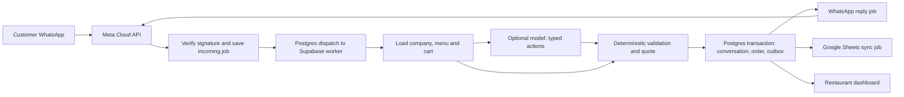

# Orderly

A working local MVP for a WhatsApp restaurant ordering platform. Customers use the restaurant’s WhatsApp number; owners and staff use this dashboard to manage menus, orders, and conversations. The application replaces n8n with its own TypeScript ordering engine.

**Current status (17 September 2026):** deployed on Cloudflare and Supabase, with public pages, workspace URLs, configurable bots/models, security controls and responsive UI based on `Claude-UI-Rayyan`. Laziza remains paused and unconnected. See the [implementation and launch handover](docs/ORDERLY-IMPLEMENTATION-2026-09-17.md), [audit](docs/ORDERLY-AUDIT-2026-09-16.md) and [Pakistan budget](docs/ORDERLY-BUDGET-2026-09-16.md). No real WhatsApp message was sent during this implementation pass.

## Run locally

Requires Node.js 22.12+ or 24+. Tested with Node 24 on Windows.

```powershell
npm ci
npm run dev
```

Open [Orderly locally](http://127.0.0.1:5173). The API listens on `127.0.0.1:4000`.

No `.env` file is needed for the demo. If you want to configure integrations locally, copy `.env.example` to `.env`. Keep `APP_MODE=demo` while exploring. Never commit `.env`, `.local`, or service account files.

The fictional Dastarkhwan and Bun & Co. workspaces have separate menus, sample orders, and conversations. Changes are persisted to `.local/data.json`. It is a single-process development store, not the production database. Back up that file and `.local/credential.key` together if you save credentials locally.

### Try the full flow

1. Choose Dastarkhwan and open **Test your bot**.
2. Send `menu`, then `2 chicken biryani`.
3. Use **Add order details** to enter a name and pickup or delivery details.
4. Check the total, then **Confirm order**.
5. Open **Orders**, select the new order, and **Accept order**.
6. Switch to Bun & Co. to see its separate records.

Try `mujhe 2 biryani chahiye`, `مینو`, a sold-out item, or **Talk to staff**. The free demo uses a deliberately limited parser. Natural-language understanding beyond its supported patterns requires a configured model. The same ordering rules validate both paths.

**Test your bot creates demo conversations, even on a live deployment.** These never send WhatsApp messages. If you connect a real Sheet, confirmed demo orders can enter that Sheet through the sync queue: use a dedicated test workspace and spreadsheet.

Local demo mode does not automatically dispatch cloud queue jobs. Use **Integrations → Retry failed jobs** to process pending Sheet jobs locally after configuring a test spreadsheet. Hosted automatic processing requires the Supabase worker and Vault-backed scheduler configuration.

## What is implemented

- Responsive dashboard, business switching and creation, menu CRUD, variants, extras, availability, and CSV import.
- Pickup, cash delivery, delivery areas and fees, opening days/hours, approved FAQ answers.
- English, Urdu and Roman Urdu ordering responses; prices calculated in integer paisa.
- Persistent cart, versioned customer review, explicit confirmation, and pending orders awaiting staff acceptance.
- Order status workflow, export CSV, inbox, staff takeover and manual replies.
- OpenAI, Anthropic and Gemini adapters with business-owned or platform API keys. Provider changes keep the same application rules.
- Monthly AI budget reservations, bounded model context/actions, conservative accounting for uncertain calls, and message burst handoff.
- Direct Meta webhook verification, message deduplication, outbound replies and status templates.
- Embedded Signup UI, server code exchange, granted account/phone validation, subscription and optional number registration.
- Coexistence live staff-message echoes pause automation and appear in the inbox. This requires eligible Meta Business App onboarding.
- Google Sheets menu reads and order writes with stable order IDs, retries and duplicate-row reconciliation.
- Supabase Auth, tenant membership checks, database RLS, atomic order/outbox transactions, and worker leases.
- Incoming messages process in arrival order per company and customer, including retries; failed messages block later automation until recovery.
- Cloudflare static hosting, Hono on Supabase Edge Functions, and Postgres job dispatch with minute recovery. Repeated worker crashes stop after five attempts. No n8n service is used.

## How the brain works



`src/domain/engine.ts` is the portable core. A model can interpret an item request or suggest an action; it cannot select another company, supply a price, write to a database, or accept an order. Replies about transactions come from the engine. FAQ responses use owner-approved text rather than arbitrary model prose.

A customer must see the current quote and explicitly confirm it. A price, option, delivery fee or cart change requires another review. Postgres rechecks the catalog at order insertion. Concurrent acceptance and cancellation use a conditional status update; customer cancellation also checks bot/staff ownership and commits its conversation state atomically. Outbox jobs are saved with the transaction, so a queue dispatch failure does not erase an order.

Model independence means stable rules and interchangeable adapters. It does not mean every model understands customer language equally well. Evaluate new model IDs on real restaurant examples before enabling them.

## Validation

```powershell
npm test
npm run build
npm run format
```

Tests cover the engine, Hono API, local persistence, credential encryption, imports, webhook signatures, replay protection, staff permissions and coexistence echoes. The Postgres suite executes the actual migrations in PGlite, including transactions, RLS, grants, catalog changes, budget holds and competing order updates. These are local tests, not a substitute for a real Supabase/PostgREST and Meta staging run.

The browser flow has been exercised at mobile and desktop widths: menu → cart → review → confirm → staff acceptance → company switch.

## Stack and cost decision

The implemented stack is **React/Vite on Cloudflare static hosting + Hono on Supabase Edge Functions + Supabase Postgres/Auth/Cron**, with direct Meta and Google APIs. The [free hosting plan](docs/FREE-HOSTING-PLAN.md) records quotas and tradeoffs. Existing Vercel queue and deployment files have been removed; the model-independent order engine and multi-company database remain.

| Database                      | Free database allowance                 | Why it matters here                                                                             |
| ----------------------------- | --------------------------------------- | ----------------------------------------------------------------------------------------------- |
| Supabase                      | 500 MB, plus 1 GB separate file storage | Postgres transactions, SQL constraints, RLS and Auth fit orders and company membership. Chosen. |
| Firebase / Firestore Standard | 1 GiB, with daily read/write allowances | More free database storage, but a document model and operation-based billing.                   |
| Neon                          | 0.5 GB per project                      | Good Postgres alternative; Supabase’s integrated project services fit this implementation.      |

These allowances were checked September 2026: [Supabase pricing](https://supabase.com/pricing), [Firebase pricing](https://firebase.google.com/pricing), [Neon pricing](https://neon.com/pricing). No comparative latency benchmark has been run. Put the database near the function region and measure actual traffic before choosing more compute.

Local development and the selected hosting plans start at **$0**, within their free quotas. Cloudflare serves the static dashboard; Supabase includes 500,000 function invocations. The scheduler checks for due jobs inside Postgres and invokes workers only for work. Vercel Hobby's personal, non-commercial restriction is one reason for changing hosts. [Cloudflare static pricing](https://developers.cloudflare.com/workers/static-assets/billing-and-limitations/), [Supabase pricing](https://supabase.com/pricing), [Vercel Hobby terms](https://vercel.com/docs/plans/hobby).

Supabase Free works for an early test but can pause after inactivity and has no automatic backups. Pro starts at $25/month with the first project, 8 GB disk and daily backups; that is a later upgrade option, not an initial requirement. Multiple restaurants share one project with tenant isolation; a separate paid project per restaurant is not required. [Supabase pricing](https://supabase.com/pricing).

Do not assume messaging or AI is free: confirm the selected model's quota, Google project's billing tier and current destination-country Meta rates before live testing or quoting a client. Hosting quotas are separate from API charges. [Gemini pricing](https://ai.google.dev/gemini-api/docs/pricing), [Meta pricing](https://developers.facebook.com/documentation/business-messaging/whatsapp/pricing).

## Connect real accounts

Follow [the deployment guide](docs/DEPLOYMENT.md) for Supabase, Cloudflare, Meta, Google Sheets and the activation checklist. The keys are supplied through server environment variables or the encrypted Integrations forms. Do not put service-role, Meta, Google or model secrets in `VITE_*` variables.

## Scope and next milestones

This is a pilot foundation. Live-account verification remains necessary. Team accounts and membership are founder-managed in Supabase; there is no self-service invitation or subscription billing flow yet. The dashboard loads up to 500 recent orders and 200 recent conversations. Older orders remain in the database; pagination and aggregate reporting are the next scaling work. Conversation messages are currently stored in JSON snapshots and should move to a paginated message table before high-volume rollout.

Coexistence currently handles new staff echoes, including edit/delete notices. Historical chat imports, contact synchronization, full media rendering, voice-note transcription, payments, precise inventory reservations, delivery tracking, and arbitrary workflow building are outside this version. Media requests go to staff. Availability is an item on/off flag, not a stock count. Very large quotes that cannot fit a complete WhatsApp review are held for staff rather than truncated.

External APIs cannot guarantee exactly-once side effects after an ambiguous network timeout. Orders are deduplicated internally; spreadsheet retries reconcile by order ID. A WhatsApp reply may still be repeated if Meta accepted it but the response was lost. Monitor traces and failed jobs during the pilot. Add cursor-based history, retention controls and load testing before expanding beyond a small founder-managed restaurant pilot.
