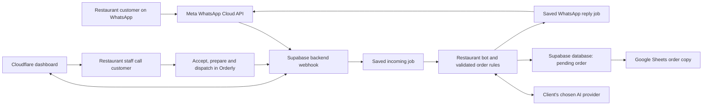

# Orderly: product, UI, security and launch audit

**Audit date:** 15–16 September 2026  
**Requested scope:** audit and implementation plan. Product implementation and deployment are outside this pass.  
**Verdict:** the restaurant order engine has a useful foundation, but Orderly is not ready for unattended, self-service client onboarding. A supervised restaurant pilot is the appropriate next release after the priority fixes below.

## 1. The answers in brief

| Question | Answer |
|---|---|
| Where are the backend and database? | Both are on Supabase. Supabase also handles login. Cloudflare serves the frontend. |
| Do I need Hostinger? | No. Cloudflare already hosts this website. |
| Should I buy Supabase Pro? | It is a reasonable production baseline. It does not finish WhatsApp onboarding or fix application issues. Review the worker lease before running production on Pro. |
| Do I need Cloudflare Pro? | Not for the current static frontend. Cloudflare Free plus Supabase Pro is the recommended starting stack. |
| Why does the URL never change? | Dashboard navigation changes a React state variable. It has no application router. Hosting already supports SPA fallback. |
| Can I have slugs? | Yes: for example, `/app/laziza/orders` and `/app/laziza/bot`. Authorization must still use server-validated membership. |
| Can the address become `orderly.workers.dev`? | Not by removing the account part of a Worker address. Worker URLs use `<worker>.<account>.workers.dev`. A custom domain is the cleanest solution. |
| Can I use Vercel? | Technically yes for the frontend; the existing backend can stay on Supabase. It adds another provider and a commercial-plan cost. The exact `orderly.vercel.app` URL already responds with a different application; ownership/assignment was not verified. |
| Does a privacy policy exist? | Yes, publicly at `/privacy`; `/terms` and `/data-deletion` also exist. They need clearer ownership, contact details and operational backing. |
| Is a landing page necessary? | It is useful for sales, trust and explaining onboarding. Bot execution does not require one. Keep it on the same Cloudflare deployment. |
| Can I edit personality, goals and workflow today? | No dedicated configuration exists. The restaurant prompt, permitted actions and workflow are coded. FAQs and business settings provide limited customization. |
| Does the model list update automatically? | No. Provider choices and defaults are static; the model field is text. Discovery and compatibility checks must be implemented. |
| Does Facebook login immediately activate WhatsApp? | No. It authorizes business assets as part of Meta onboarding; a supported business number, permissions, subscription, billing/readiness and an end-to-end test are also needed. |

## 2. What was checked

### Fresh checks

| Check | Result |
|---|---|
| Existing automated suite | **132 tests passed across 9 files**. Covers order rules, tenancy, validation, integrations and job behavior. |
| Production build | **Passed** TypeScript checking and Vite build. |
| Dependency audit | **0 reported vulnerabilities** in the installed dependency tree at audit time. |
| Supabase/Deno edge smoke test | **Passed** build, health response and anonymous API rejection. |
| Public frontend and legal routes | Root, privacy, terms and deletion pages respond. Arbitrary paths also return the same SPA HTML. |
| Live unauthenticated API probes | Bootstrap, worker and recovery access rejected; unsigned webhook rejected; invalid verification token rejected. |
| CORS | Configured frontend origin accepted; unrelated origin rejected. |
| Authenticated live UI | Read-only inspection of the existing Laziza workspace and integrations. |
| Responsive inspection | Desktop 1440×900; narrow phone 320×740; phone 390×844; tablet 768×1024; laptop breakpoint 1024×768. |
| Offline targeted probes | Reproduced unverified WhatsApp mapping, persistence after failed connection, paused tester behavior and demo order Sheet jobs. Confirmed local order creation followed by staff acceptance. |

Live Laziza at inspection: **no menu items, no orders, no conversations, bot paused, mock provider, WhatsApp disconnected, Sheets disconnected and no delivery zones**. The Facebook onboarding button was enabled after loading. An enabled button does not establish Meta approval or a functioning number.

### Scope limits

This was source review, safe HTTP checking, manual browser inspection and local automated testing. It was not a destructive penetration test, a load test, a complete assistive-technology certification or a legal compliance certification. No real customer messages were sent. No live orders or connections were changed. No real WhatsApp end-to-end order was exercised in this pass. Current Meta approval, provider billing, hosted RLS configuration and backup restoration were not independently verified in their administration consoles.

Local source already contained changes before the audit; those were preserved. Findings based on code describe that working tree. A successful local build does not prove the identical backend revision is deployed. Previous deployment notes record a successful synthetic Gemini-to-Sheets test, which is historical evidence rather than a newly repeated test.

Evidence: [HTTP probes](<C:/Meeru/Works/My chatbot for daddy/docs/audit-assets-2026-09-15/http-checks.json>), [offline probes](<C:/Meeru/Works/My chatbot for daddy/docs/audit-assets-2026-09-15/offline-probes.json>).

## 3. How everything connects



Cloudflare delivers the website files. The browser calls the Supabase backend. Supabase stores businesses, users/memberships, products, conversations, orders, integration credentials, usage and background jobs. Meta delivers incoming WhatsApp events to the backend. The selected AI provider interprets text; the application validates and applies actions. Google Sheets receives order rows.

An AI API key identifies the paying provider account; it is not itself a model purchase. The selected API model and actual usage determine AI cost. A paid ChatGPT subscription is not the Orderly backend's API billing arrangement.

### Your agency model

- You are the platform administrator and can manage multiple businesses.
- Laziza gets its own company/workspace, menu, phone-number mapping, integration credentials and owner/staff memberships.
- Each restaurant can supply and pay for its own AI key and Meta messaging account.
- Other restaurant staff must not be able to read Laziza's orders, credentials or customers.
- You normally pay for one shared Supabase project and one Cloudflare frontend, rather than buying a separate Supabase Pro subscription for every restaurant. Shared capacity still needs monitoring.

The backend already implements the core company separation. A usable staff-invitation and client-provisioning interface is still missing; current membership administration relies on backend administration.

## 4. The Laziza Foods journey

### Intended flow

1. You create Laziza's workspace and invite its owner/staff.
2. Configure chicken pulao, cold drinks, zarda, sizes, prices, availability, delivery areas and fees.
3. Connect Laziza's owned WhatsApp business number, its AI provider and its order spreadsheet.
4. A customer messages the restaurant: “One chicken pulao, one cold drink and zarda.”
5. The bot identifies exact menu items and asks about unresolved size/flavour/quantity choices.
6. The sender's WhatsApp number is captured from Meta. Ask for the customer's name, pickup/delivery and complete address/area when delivering. A different callback number should be an explicit optional field if needed.
7. Show the final items, quantities, delivery fee and total. Ask for explicit confirmation.
8. On confirmation, save one **pending** order to Supabase and queue the Sheet update.
9. Tell the customer it has been received and awaits restaurant confirmation. Do not imply that food has been dispatched.
10. Laziza staff call the customer, confirm the order/address and record the result.
11. Staff accept, prepare, mark ready, dispatch and complete the order in Orderly. Updates are copied to the Sheet; WhatsApp status updates follow the allowed messaging window/template rules.

**Customer confirmation and restaurant acceptance are separate events.** The existing engine already makes this distinction. The phone call remains a human action; call logging and a compulsory “confirmed by phone” gate would be new features.

### Current implementation versus the requested journey

| Capability | Current state |
|---|---|
| Menu, prices, options, availability | Implemented; Laziza still needs its menu populated. |
| English, Urdu and Roman Urdu handling | Implemented paths exist; real-provider quality needs representative restaurant examples. |
| Name, sender phone, address, delivery area | Implemented. Phone is supplied by the WhatsApp event. |
| Explicit review and customer confirmation | Implemented with server-side price validation and duplicate protection. |
| Pending order before staff accepts | Implemented. |
| Orders to Google Sheets | Implemented through queued writes and reconciliation by order ID. |
| Staff call confirmation record | Missing: caller, time, outcome and verified address should be stored. |
| Dispatch status | Implemented state transitions; no rider tracking or delivery proof. |
| Flow/personality editor | Missing. |
| Voice notes, images, location-message interpretation | Currently handed to staff, not interpreted into orders. |
| Payments, stock quantities, tax/discount engine | Not implemented as a complete system. |

### Spreadsheet behavior

The order tab contains Order ID, reference, creation time, customer, phone, fulfillment, address, area, items, subtotal, delivery fee, total and status. Orderly is the operational source of truth. **Changing a status in Google Sheets does not update Orderly today.** Menu import/read from Sheets is a different integration path and is supported.

For the initial product, let staff use the Sheet to view orders and Orderly to accept/dispatch them. If editing Sheet statuses is required, design a separate validated inbound synchronization process with conflict rules, permissions and an audit trail.

## 5. WhatsApp onboarding explained

Facebook sign-in establishes that a person is allowed to connect business assets. It is not the customer messaging channel and does not automatically turn a personal WhatsApp account into a bot.

The practical sequence is: business administrator signs in → selects/creates business portfolio and WhatsApp business account → selects/verifies an eligible business number → grants required access → Orderly securely exchanges the authorization and subscribes to events → number and billing/readiness checks pass → a real test message is received and answered → automation is enabled.

Orderly needs the appropriate Meta application configuration, review/access for onboarding other businesses and a working HTTPS webhook. Laziza needs control of the business assets and phone number. Display-name, number, account and billing restrictions can prevent activation even after login. Meta's official [Embedded Signup documentation](https://www.postman.com/meta/whatsapp-business-platform/documentation/du6gzjv/embedded-signup) describes this onboarding and permission/review relationship.

There are two onboarding choices:

- **Standard Cloud API:** staff work through Orderly's inbox for the API-connected number.
- **Eligible WhatsApp Business App coexistence:** the same business number can remain usable in the phone app alongside the platform, subject to Meta's supported onboarding and eligibility. The code contains a coexistence path and staff-message echo handling, but it has not been verified end to end with Laziza.

These are WhatsApp messages, not SMS. Customers keep using WhatsApp normally; they do not log into Orderly or connect Facebook. Free-form business replies are permitted within the 24-hour window after the customer's most recent message. Outside that window, use an approved template where permitted. Provide a clear route to a person. [WhatsApp Business Messaging Policy](https://whatsappbusiness.com/policy/)

## 6. Feature and product assessment

| Area | Useful foundation | Main gap |
|---|---|---|
| Overview | Counts, chart, setup checklist, recent activity | Large marketing hero pushes pending work down; counts are based on limited loaded records. |
| Orders | Search/filter, detail modal, transitions, export | No pagination-backed full export, call outcome or assignment; phone view relies on horizontal table scrolling. |
| Inbox | Conversation history, handoff, staff reply, resume | No strong unread/assignment/escalation experience; weak mobile list/detail layout. |
| Menu | CRUD, options, aliases, availability, CSV and Sheet catalog | Clarify replace/import effects, improve preview/validation and large-catalog retrieval. |
| Bot tester | Structured cart and natural-language path | Shares live enable flag, AI billing and potentially Sheet effects. |
| Integrations | Encrypted credentials, tests, Embedded Signup | Tests are incomplete readiness signals; disconnect/revocation workflow is missing. |
| Settings | Hours, zones, FAQs, provider/model text, budget | Separate bot behavior and model management are missing. |
| Businesses | Multi-business administrator management | Invitations, client onboarding, billing/subscriptions and owner recovery are incomplete. |
| Reliability | Durable jobs, retries, ordering, duplicate controls | Operator alerts, delivery error diagnosis and paid-plan lease review needed. |

## 7. Prioritized findings

P1 means fix before unattended paying-client operation. P2 means address in the initial product completion work. These labels combine operational, privacy and product risk; they are not all exploitable security vulnerabilities.

### P1-01 — Tester orders can reach a real spreadsheet

**Evidence:** `handleTurn` queues `sheet_sync` for every created order when Sheets is configured; it does not exclude the demo channel. The offline probe created a demo order and found a pending Sheet job. It deliberately disabled all network calls, so no real Sheet was written during this audit. Real AI calls can also be billed from the tester.

**Impact:** testing can contaminate operational orders, reports and connected Sheets. The interface's assurance about no WhatsApp messages does not explain these other effects.

**Fix:** sandbox conversations/orders/configurations; no production integration jobs by default; separate test Sheet if explicitly selected; show whether a test will use paid AI. Keep sandbox records out of live metrics.

Source: [service.ts](<C:/Meeru/Works/My chatbot for daddy/server/service.ts:180>), [tester](<C:/Meeru/Works/My chatbot for daddy/src/components/Conversations.tsx:156>).

### P1-02 — Manual WhatsApp mapping is saved before ownership and connection success

**Evidence:** the generic integration endpoint checks uniqueness but does not first verify that the supplied token owns the number. An offline request with only a fabricated phone ID returned 200 and established a lookup mapping. Supplying a WABA without credentials returned 409 after the new mapping had persisted.

**Impact:** a permitted workspace owner can reserve an unassigned phone ID without proving control; failed setup can replace the workspace's active configuration. This is not proof of takeover of an already assigned number: the uniqueness check protects those mappings.

**Fix:** validate token grants, business account and number ownership before activation. Save candidates separately; retain the previous working connection if verification/subscription fails. Apply the stronger Embedded Signup validation to the manual path too.

Source: [integration save endpoint](<C:/Meeru/Works/My chatbot for daddy/server/app.ts:540>).

### P1-03 — Customer-data handling must match the selected AI provider's terms

Deployment notes recorded a free Gemini project; the prompt includes recent conversation text and cart details, which can contain customer names and addresses. Google's unpaid API terms permit product improvement/human review and instruct developers not to submit personal information. Paid-service treatment differs. Current billing was not rechecked, and the fresh audit used fictional data only. [Gemini API terms](https://ai.google.dev/gemini-api/terms)

**Fix:** verify an appropriate paid billing/data-processing arrangement before real customer traffic, document the provider, minimize personal data sent to the model, and separate test from production credentials/projects. Do not assume paying Supabase changes Google's terms.

Source: [model context](<C:/Meeru/Works/My chatbot for daddy/server/integrations/models.ts:93>), deployment notes.

### P1-04 — Readiness, failure diagnosis and human escalation are incomplete

A connected credential is not proof that the exact selected model can generate a valid action. Provider tests list models but discard the list. Enabling a bot does not require a populated menu, ready phone and successful end-to-end order. A paused company also makes the playground return an empty reply and switch to human mode; this was reproduced.

AI failures collapse into a generic staff handoff, hiding the cause. Meta status callbacks create traces, but there is no clear per-message sent/delivered/failed timeline with actionable delivery errors. “Staff will help” is not backed by an out-of-app alert; someone must watch the inbox.

**Fix:** readiness checklist; exact model generation test; sandbox independent of live pause; reason codes and correlation IDs; visible integration health; failed-job detail/retry controls; staff alerts and overdue handoff indicators. Do not automatically retry uncertain order creation or paid external sends without reconciliation.

Source: [provider test](<C:/Meeru/Works/My chatbot for daddy/server/app.ts:576>), [handoff](<C:/Meeru/Works/My chatbot for daddy/server/service.ts:135>), [Meta statuses](<C:/Meeru/Works/My chatbot for daddy/server/app.ts:148>).

### P1-05 — Privacy promises lack a complete operational process

Public legal pages exist, but the policy gives no clear operator identity or privacy email and uses vague retention wording. It claims clients can disconnect integrations in Orderly; no complete disconnect API/UI is present. There is no complete customer-data export/deletion/retention job and support runbook.

**Fix:** add operator/contact details, concrete retention choices, processors, data flows and request handling. Implement credential removal/revocation, export and deletion with job cancellation and treatment of backups/Sheet copies. Align the text with actual behavior. Link the pages from login, public footer and integration onboarding.

Source: [Legal.tsx](<C:/Meeru/Works/My chatbot for daddy/src/components/Legal.tsx:20>).

### P1-06 — Worker leases assume the Supabase Free runtime

The worker/conversation lease is fixed at **180 seconds**, with a source comment explicitly relying on Free workers ending after 150 seconds. Supabase documents a **400-second paid-plan worker lifetime**. Database requests do not all have a bounded deadline. A sufficiently delayed worker could therefore still be running when its lease becomes eligible for recovery on Pro. This is a code/runtime risk, not an observed duplicate during the audit. [Supabase execution limits](https://supabase.com/docs/guides/functions/limits)

**Fix:** align lease lifetime with a bounded job deadline and current hosting plan, or renew leases with ownership/fencing checks. Test a stalled worker and recovery overlap, especially around non-idempotent external sends. Include this small but important review in the Pro upgrade rollout.

Source: [lease constant](<C:/Meeru/Works/My chatbot for daddy/server/service.ts:18>), [job execution](<C:/Meeru/Works/My chatbot for daddy/server/service.ts:333>), [database client](<C:/Meeru/Works/My chatbot for daddy/server/storage/supabase.ts:37>).

### P2-01 — Dashboard routes are state-only

`useState('overview')` and `setPage` choose sections. URL, back/forward, bookmarking and refresh do not identify the section. Unknown public paths return the app shell rather than a meaningful not-found view.

**Fix:** introduce a router, route-level loading/error states, URL-based workspace/page selection, real links, detail paths and a 404 view. Preserve auth return paths. Cloudflare's existing SPA fallback can serve deep links.

Source: [App.tsx](<C:/Meeru/Works/My chatbot for daddy/src/App.tsx:51>), [navigation](<C:/Meeru/Works/My chatbot for daddy/src/App.tsx:170>), [wrangler.jsonc](<C:/Meeru/Works/My chatbot for daddy/wrangler.jsonc>).

### P2-02 — Phone layouts need structural changes

- At 320px viewport width, the document measured 360px wide because the body has `min-width: 360px`. Text and controls clip horizontally.
- At 390×844, the tester's composer started around y=941; cart information was farther down. A fixed 42rem chat card plus page content makes the primary action inconvenient.
- At 390px, the Orders table was 672px wide inside roughly 334px. Status/total require lateral scrolling.
- Below the tablet breakpoint, the inbox stacks its potentially long list above the conversation instead of offering a focused detail screen.
- 768px and 1024px Orders views did not overflow the document in the measured sample. This does not establish all-screen/device correctness.

**Fix:** remove the hard minimum; mobile order cards; mobile inbox list→detail navigation; composer sized to the available dynamic viewport; collapsible cart/menu; scrollable side navigation; 44px practical touch targets; keyboard, zoom, long Urdu text and virtual-keyboard checks.

Sources: [CSS](<C:/Meeru/Works/My chatbot for daddy/src/index.css:20>), [chat dimensions](<C:/Meeru/Works/My chatbot for daddy/src/components/Conversations.tsx:156>), [inbox](<C:/Meeru/Works/My chatbot for daddy/src/components/Conversations.tsx:574>).


Other captures: [phone tester](<C:/Meeru/Works/My chatbot for daddy/docs/audit-assets-2026-09-15/phone-bot-tester-390.png>), [phone orders](<C:/Meeru/Works/My chatbot for daddy/docs/audit-assets-2026-09-15/phone-orders-390.png>).

### P2-03 — Repeated full bootstrap and tenant scans will become expensive

Visible operational pages refresh the full bootstrap every 15 seconds. It includes large conversation histories, orders, products, traces and usage. Live authorization fetches all companies and checks membership per company; each role check also queries platform-admin status. Growth increases database requests even for a single ordinary user.

Orders are capped at 500 and conversations at 200, while overview labels imply complete totals. Exports from loaded records can omit older orders. Conversations store expanding message arrays; usage reads cover historical data.

**Fix:** fetch memberships directly for the user; bounded paginated lists; indexed aggregate metrics; date-ranged usage; paginated message storage; selected-conversation refresh; conditional polling/realtime only where useful. Report exact export scope. Show refresh failures and stale-data state instead of silently suppressing them. Sheet-backed menus are refreshed before mutating bot turns; cache/version that data and budget shared service-account quotas. The standard Sheets limit includes 60 reads/minute per user/project, with a service account treated as one account. [Sheets limits](https://developers.google.com/workspace/sheets/api/limits)

Source: [polling](<C:/Meeru/Works/My chatbot for daddy/src/App.tsx:139>), [authorization](<C:/Meeru/Works/My chatbot for daddy/server/app.ts:240>), [repository limits](<C:/Meeru/Works/My chatbot for daddy/server/storage/supabase.ts:44>).

### P2-04 — Frontend hardening and account controls need completion

The sampled frontend responses lacked CSP, frame restrictions, `nosniff`, a referrer policy and an HSTS header. The backend already supplies several security headers. The missing header observation does not imply the HTTPS connection was unencrypted or that a working XSS exploit was found.

**Fix:** deploy a tested frontend CSP, including only the origins needed for Supabase and the Meta SDK; frame restrictions, referrer policy and other appropriate headers; account MFA/step-up for sensitive owner actions; password recovery; session/access management; distributed API rate limits; immutable actor-attributed administrative events. Cloudflare Pro on the website would not, by itself, put the direct Supabase API behind Cloudflare's WAF.

### P2-05 — Model compatibility and budget controls need a lifecycle

The provider and model defaults are hardcoded; the model input is free text. Unknown models require manually supplied token prices. A successful provider test can coexist with an invalid/unavailable selected model. Error reasons and provider-reported usage need to be visible. Application estimates are not invoices, particularly for free tiers, cached tokens and provider-specific reasoning usage.

**Fix:** implement the model catalog in section 9; publish vetted prices with timestamps; actual usage reconciliation; budget alerts and predictable handoff behavior on budget exhaustion. Add per-client and platform safety limits for platform-funded keys.

### P2-06 — Operational UX and onboarding need to match restaurant work

Put pending orders, waiting customers and failures first on the dashboard. Move promotional copy to the landing page. Add an onboarding checklist, clear live/test badges, save/unsaved state, exact active model, staff alerts, role management and useful empty states. Explain service-account Sheet sharing or provide a carefully scoped Google connection flow. Update stale README/deployment instructions to match Supabase/Cloudflare.

## 8. Security controls already worth keeping

- Server-side Supabase identity verification and company/role checks; owner-only integration changes; resource ownership checks.
- RLS and restricted database functions in the migrations; integration secrets separated from browser-readable data.
- AES-256-GCM encryption for stored integration credentials. Secrets are used server-side.
- Meta webhook signature verification, duplicate event protection, saved jobs and recovery.
- Exact origin allowlisting, bounded inputs and structured action validation.
- Prices/options/totals enforced by application rules. The model cannot invent a price or directly accept an order.
- Confirmation tied to current cart state; edits invalidate old confirmation; atomic conversation/order/job updates.
- Budget reservations and handoff when AI/integrations fail.
- Sheet writes use RAW values; CSV export neutralizes formula-like values.

Keep these controls when adding flexible bot settings. A persona instruction must not override tenant isolation, customer consent, price rules or human approval requirements.

## 9. Bot settings and model picker: implementation specification

### Dedicated Bot section

| Tab | Fields and behavior |
|---|---|
| Overview | Live/paused/test status, exact provider/model, last successful reply, config version, spend, failures and readiness. |
| Personality | Name, tone, English/Urdu/Roman Urdu preference, brevity, greeting, approved wording. |
| Goal | For example: collect a complete food order and save it pending a restaurant phone call. |
| Workflow | Ordered collection steps, required fields, delivery/pickup branches, customer confirmation, staff call gate, dispatch transitions and allowed exceptions. |
| Knowledge | Menu/FAQ sources, policies, hours, service areas, source owner and last synchronization. Additional text/documents need versioning and size limits. |
| Model & budget | Provider, available compatible models, key owner, rates, token limits, monthly budget, exact-model test, optional approved fallback. |
| Human handoff | Triggers, opening hours, pause/resume rules, who receives alerts, response target. |
| Test & publish | Draft configuration, isolated test conversations, regression examples, change summary, publish and rollback. |
| Activity | Customer-visible exchange, interpreted actions, validation decisions, model/config version, latency/cost, queue and delivery/sync results. |

“Why did the bot do this?” should show meaningful decision events, such as “asked for address because delivery requires one,” without attempting to expose private model chain-of-thought.

Use a validated workflow configuration for actions and approvals, with natural-language instructions for tone and knowledge. A single unrestricted text prompt is insufficient for reliable transactions. The current engine templates must also accept approved tone/language configuration; editing only the LLM prompt would leave many replies unchanged.

Example Laziza goal: “Collect menu items, quantities, name and complete delivery details. Show the exact total and get the customer's confirmation. Save the order as awaiting a phone call. Explain that Laziza will call before preparing/dispatching. Escalate unavailable items, unclear addresses, allergies and complaints.”

### Current model behavior

| Provider | Current code default | Selection behavior |
|---|---|---|
| OpenAI | `gpt-5.4-mini` | Static default; editable model text. |
| Anthropic | `claude-haiku-4-5` | Static default; editable model text. |
| Gemini | `gemini-3.5-flash-lite` | Static default; editable model text. |
| Mock | `deterministic-demo` | Local rules; no AI provider call. |

These are code defaults, not a claim that every workspace currently uses them. Laziza was on Mock. Connecting a provider key does not automatically select a new model.

### How automatic model discovery should work

1. Fetch available models on the server using the connected account, handling provider pagination and rate limits.
2. Cache per provider/credential scope; refresh on connection, on demand and periodically. Never expose the key to the browser.
3. Filter for supported text/action generation; annotate capabilities, cost and availability. Model-list responses do not supply a complete universal pricing/compatibility guarantee.
4. Keep the selected model pinned. Show new models as options without silently switching production behavior.
5. Run a structured-generation test and restaurant regression cases before publishing a replacement.
6. Warn when a selected model disappears or is deprecated. Use only an explicitly approved compatible fallback, otherwise hand off and alert staff.
7. Maintain provider SDK/API adapters and a reviewed pricing catalog. Future model APIs may need code changes even if their IDs appear automatically.

Official discovery endpoints exist for [OpenAI](https://developers.openai.com/api/reference/ruby/resources/models), [Gemini](https://ai.google.dev/api/models) and [Anthropic](https://platform.claude.com/docs/en/api/models/list). Consequently, an automatically refreshed dropdown is feasible; a promise that every future GPT/Gemini/Claude model will work without maintenance is not.

A separate small-model/heavy-model policy can be added later using measured task categories and cost limits. The current app uses one configured model per company; it does not contain that routing policy.

## 10. Routes, domain and public website

Recommended routes:

```text
/
/pricing
/contact
/privacy
/terms
/data-deletion
/login
/app/:companySlug/overview
/app/:companySlug/orders
/app/:companySlug/orders/:orderId
/app/:companySlug/inbox/:conversationId
/app/:companySlug/menu
/app/:companySlug/bot
/app/:companySlug/integrations
/app/:companySlug/settings
```

Slugs are human-readable identifiers; they do not grant access. The same server-side membership checks must apply when the URL is edited.

Cloudflare documents Worker addresses as `<worker>.<account-subdomain>.workers.dev`. Renaming an account subdomain does not remove that level. [Cloudflare workers.dev routing](https://developers.cloudflare.com/workers/configuration/routing/workers-dev/)

**Recommendation:** retain Cloudflare frontend + Supabase backend and attach an available `.com` domain. Use its root for marketing and `/app` for the dashboard, or a separate `app.` subdomain if preferred. No additional hosting subscription is needed for either arrangement. Domain availability, including `orderly.com`, has not been established.

`orderly.vercel.app` returned HTTP 200 with title “Cafe POS - Multi-Restaurant Point of Sale” during the public check. It is not a confirmed available alias. If a Vercel migration is later chosen, first verify project ownership/alias rights, then update frontend API configuration, Supabase auth redirects, exact CORS origins, Meta app domains/redirect settings and deployment redirects. The backend can remain on Supabase. Vercel's Hobby plan is personal/non-commercial; plan for Pro for this business. [Vercel plans](https://vercel.com/pricing)

### Landing page and legal pages

Build a small, truthful sales page explaining restaurant ordering, an example conversation, the staff-confirmation step, pricing/provider charges, onboarding requirements, support and a demo/contact action. Do not advertise unsupported voice notes, payments, arbitrary workflows or instant approval.

Keep privacy, terms and deletion pages public without login; link them in the public footer and in the app. The policy should identify the operator and contact address, describe restaurant/platform responsibilities, name relevant processors, explain AI/Meta/Sheet data flows, state actual retention choices and explain access/deletion requests and retained backups. WhatsApp's policy calls for a published privacy policy. [WhatsApp policy](https://whatsappbusiness.com/policy/)

Existing pages are client-rendered inside the SPA. Pre-render the public pages and provide distinct titles/descriptions so link previews, crawlers and reviewers can reliably read them. A landing page is useful commercially, while a discoverable, accurate policy is an immediate requirement for the intended integration.

Live pages: [Privacy](https://orderly.waytogalaxy999.workers.dev/privacy), [Terms](https://orderly.waytogalaxy999.workers.dev/terms), [Data deletion](https://orderly.waytogalaxy999.workers.dev/data-deletion).

## 11. Implementation sequence and acceptance checks

| Phase | Work | Release evidence |
|---|---|---|
| 1 — Safe pilot foundation | Isolate tester; verify manual number ownership before save; repair failed-setup semantics; review paid-plan leases; verify AI data terms; complete disconnect and core privacy operations. | Offline tests show no sandbox external jobs; invalid number cannot activate; previous connection survives failure; stalled worker cannot overlap side effects; revoke/export/delete paths exercised on fixtures. |
| 2 — Visibility and model control | Provider catalog, exact-model test, health/readiness, structured failure reasons, spend visibility, staff alerts and delivery status. | Invalid/deprecated model is visible; timeout/429/budget failures route to staff; delivered/failed Meta status is attributable; no activation before required checks. |
| 3 — Restaurant bot configuration | Versioned personality/goal/knowledge; configurable restaurant workflow and call-confirmation gate; draft/publish/rollback. | Laziza example works; missing address/unknown item cannot submit; edited order needs new confirmation; staff call outcome is recorded. |
| 4 — Product navigation and UI | Real routes, phone layouts, operational overview, invitations/recovery, bounded lists/metrics/exports, frontend headers. | Deep links, refresh, back/forward and access denial work; 320/390/768/1024/1440 layouts usable; keyboard/zoom/Urdu checks pass; large fixture totals/export correct. |
| 5 — Public site and pilot launch | Landing/public legal pages, custom domain, current setup guide, monitoring/restore runbook, one real restaurant pilot. | Real owned number → webhook → reply → pending order → Sheet row → staff call/accept → dispatch update; duplicate webhook and outage recovery checked; backup restored into a test environment. |

Plan roughly **20–30 focused engineering days for this initial scope**, subject to existing code changes and test findings. This is an effort estimate, not a fixed quote or a guarantee of elapsed time. Meta verification/review and client account readiness can add waiting time. A general-purpose GHL-style workflow builder is a larger later product, not merely another settings form.

Pilot acceptance should include English, Urdu and Roman Urdu, ambiguous drink/portion choices, unavailable items, address corrections, duplicate confirmations, closed hours, customer cancellation, allergies/complaints, voice/media handoff, exhausted budget, revoked credentials, late templates, Sheet outage and staff takeover. Measure real tokens, latency, handoff rate, duplicate rate and missed orders before selecting a cheaper model or selling an SLA.

## 12. Spending recommendation

Start with **Supabase Pro + Cloudflare Free + one basic domain**. No Hostinger or Vercel migration is needed. Set provider and platform spend alerts, keep one initial production Supabase project, and add paid services when measured needs justify them.

The detailed owner/client budgets, Pakistan benchmarks and quote examples are in [the budget report](<C:/Meeru/Works/My chatbot for daddy/docs/ORDERLY-BUDGET-2026-09-16.md>). A separate local calculator lets you vary traffic and support assumptions.

No application fixes, hosting migrations, subscriptions or external account changes were made in this audit pass.
